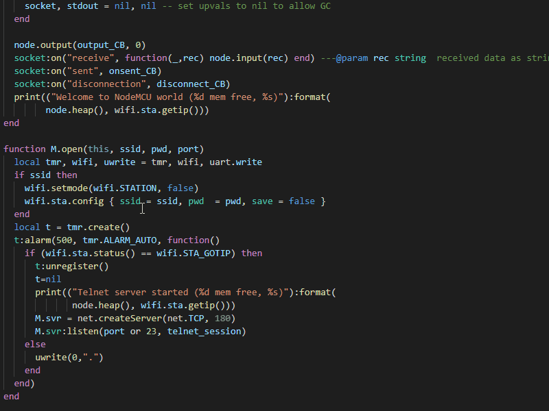
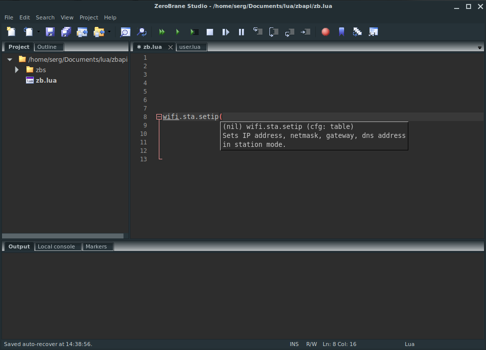

# EmmyLua annotations for NodeMCU ESP8266 & ESP32

[NodeMCU](https://nodemcu.readthedocs.io/en/release/) function annotations for autocomplete in
- Visual Studio Code
- Neovim
- IntelliJ IDEA
- ZeroBrane Studio




## VS Code and Neovim
If you use VSCode or Neovim, then you have to install **[sumneko's lua-language-server](https://github.com/sumneko/lua-language-server/wiki)** extension first.

### Install
Create directory with arbitrary name e.g. *nodeMCU-emmylua* and copy directories from this repository into it as shown in the example below.<br>
*Note:* `config.json`, `plugin.lua` and `library` are predefined names.
      
Here is the directories structure:
```
nodeMCU-emmylua
|
|___esp32
|   | config.json  # settings for esp32 environment
|   | plugin.lua
|   |___library
|       | *.lua   # files with function annotations for the dev-esp32 branch
|
|___esp8266
|   | config.json  # settings for esp8266 environment
|   | plugin.lua
|   |___library
|       | *.lua   # files with function annotations for the dev branch
|
|___esp32-idf3 (stale branch)
    | config.json  # settings for esp32-idf3 environment
    | plugin.lua
    |___library
        | *.lua   # files with function annotations for the dev-esp32-idf3-final branch
```

Then set path to the directories in the setting `User -> Lua.workspace.userThirdParty`. For example:

```json
    "Lua.workspace.userThirdParty": [
      "/home/user/nodeMCU-emmylua"
    ]
```
### Automatic including of annotation files (recommended)
  
Since version 2.3.1 of **sumneko.lua** extension you can use new feature *Automatic adapt to the project environment*.

The extension will try to determine the runtime environment by keywords from *config.json* and set the appropriate settings in *settings.json*.
      
*Hint!* When starting new project you can type in short keyword `---esp32` or `---esp8266` followed by `Enter` into *any_file.lua* in workspace and environment will set up automatically.

### Installing annotation files manually

The **sumneko.lua** extension provides a number of parameters that are stored in .vscode/settings.json.

You can set path to the directory with function annotations for esp8266 **OR** esp32 **OR** for esp32-idf3 in the setting ```"Lua.workspace.library"```.
```json
"Lua.workspace.library": [
  "path/esp<your choose>/library"
    ]
```
To perform the autocomplete some functions specify the
path to the script **plugin.lua** in the setting:
```json
 "Lua.runtime.plugin": "path/esp<your choose>/plugin.lua"
```
You have to also specify `Lua.runtime.builtin"` and `"Lua.runtime.version"` settings according with *config.json* file content.

## IntelliJ IDEA

You have to install the **[IntelliJ-EmmyLua ](https://github.com/EmmyLua/IntelliJ-EmmyLua)** plugin. The auto-completion capabilities of this plugin differ from those of the sumneko extension. Therefore, some of the advanced features will not be supported.

You will need to convert files from sumneko format to IDEA format by running **sumn2idea.lua** script from the `tools` directory.

## ZeroBrane Studio

To get auto-complete functions in **[ZeroBrane Studio](https://studio.zerobrane.com/)** you have to convert the NodeMCU API descriptions to ZeroBrane Studio format by running **sumn2zbs.lua** script.

The script requires ZeroBrane Studio already installed to run.

1. copy script `sumn2zbs.lua` to `ZBS/api/lua` folder

2. copy `esp8266` and `esp32` folders with module.lua files to `ZBS/api/lua` folder

  *Note*.
  'bme280_c_module.lua' is deprecated. You **must** delete this file from `esp8266` folder
  before converting, otherwise, the conversion will fail with an error.
  If you want to use bme280 C module instead of Lua module bme280.lua you could add lines

  ```lua

  ---@class bme280
  bme280 = {}

  ```
  in file 'bme280_c_module.lua' and delete file 'bme280.lua'.

3. run as "../../bin/lua sumn2zbs.lua "srcDir" >outputFile.lua" from `ZBS/api/lua` folder. If no "srcDir" is given, script uses ./esp8266 directory;

  `lua sumn2zbs.lua >nodemcu.lua`

   otherwise, the argument is directory's name and script uses ./"arg" directory.

  `lua sumn2zbs.lua esp32 >nodemcu32.lua`

4. launch the IDE with setting -> `api = {'nodemcu'}` or `api = {'nodemcu32'}` to confirm it's loading without issues.


